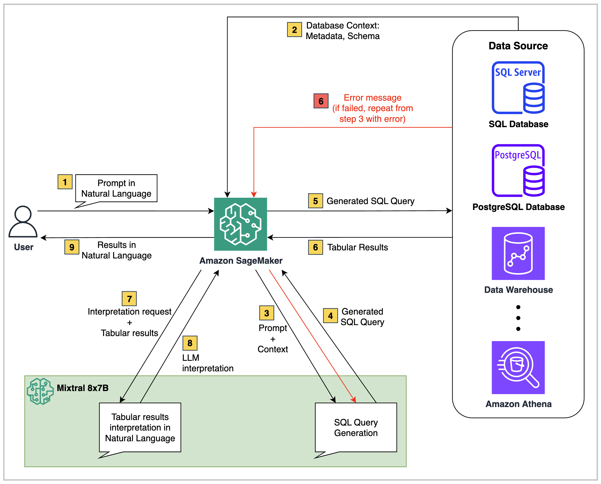
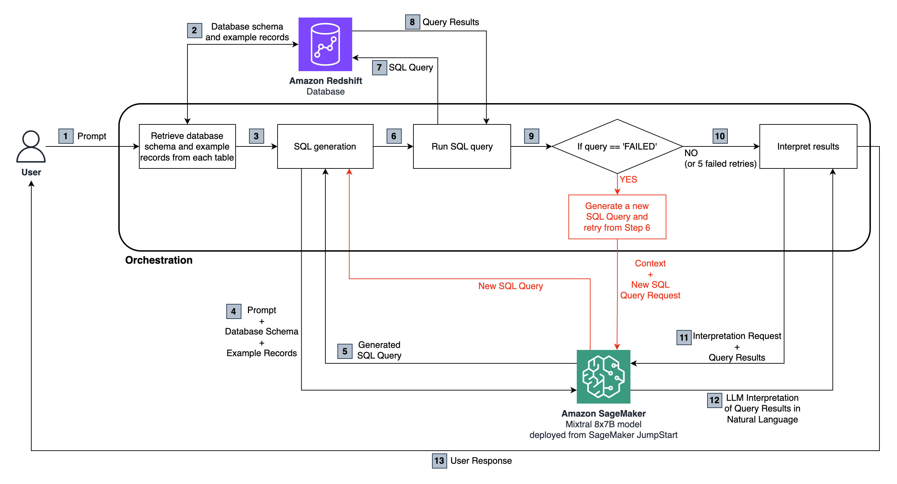

# Transforming the Way We Talk to Databases: Using Everyday Language to Search and Retrieve Data with Mixtral 8x7B

This project enables interacting with relational databases through Natural Language. Specifically, it uses the sparse Mixture of Experts (MoE) model Mixtral 8x7B Instruct, for generating SQL queries, and interpreting their corresponding tabular results to return to the user as answers. The application leverages SageMaker hosting tools to serve the model, which is deployed with a few clicks from SageMaker JumpStart. For more details, please refer to [this blogpost](https://aws.amazon.com/blogs/machine-learning/use-everyday-language-to-search-and-retrieve-data-with-mixtral-8x7b-on-amazon-sagemaker-jumpstart/).

## Setup Requirements

You can currently deploy Mixtral 8x7B on SageMaker Jumpstart with one click. Amazon SageMaker JumpStart provides a simplified way to access and deploy over 100 different open source and third-party foundation models. In order to [launch an endpoint to host Mixtral 8x7B from SageMaker JumpStart](https://docs.aws.amazon.com/sagemaker/latest/dg/jumpstart-deploy.html), you may need to request a service quota increase to access an **ml.g5.48xlarge instance for endpoint usage**. You can easily [request service quota increases](https://docs.aws.amazon.com/servicequotas/latest/userguide/request-quota-increase.html) through the AWS console, CLI, or API to get access.

You will also need access to a relational data source. Amazon Redshift is used as the primary data source in this post with the [TICKIT database](https://docs.aws.amazon.com/redshift/latest/dg/c_sampledb.html). This database helps analysts track sales activity for the fictional TICKIT web site, where users buy and sell tickets online for sporting events, shows, and concerts.

_Please review any license terms applicable to the dataset with your legal team and confirm that your use case complies with the terms before proceeding._

You will first need to [set up a Redshift cluster](https://docs.aws.amazon.com/redshift/latest/gsg/rs-gsg-launch-sample-cluster.html) if you don't already have one. Use the Amazon Redshift console or CLI to launch a cluster with your desired node type and number of nodes. Make sure to note the cluster endpoint, database name, and credentials to connect.

Once the cluster is available, create a new database and tables in it to hold the relational data. You can load data for the TICKIT database from S3 following [these steps](https://docs.aws.amazon.com/redshift/latest/gsg/rs-gsg-create-sample-db.html).

To test that you successfully added data to your Redshift cluster. Follow these steps:

1. On the Redshift console, choose _Clusters_ and select the cluster to query.
2. Click on the _Query Editor_ tab to open the query editor.
3. You can run the following sample queries, or write your own:

```
/* Find total sales on a given date. */
SELECT sum(qtysold)
FROM sales, date
WHERE sales.dateid = date.dateid AND caldate = '2008-01-05';
```

```
/* Find the top 10 buyers. */
SELECT firstname, lastname, total_quantity
FROM (SELECT buyerid, sum(qtysold) total_quantity
      FROM sales GROUP BY buyerid
      ORDER BY total_quantity
      desc limit 10) Q, users
WHERE Q.buyerid = users.userid
ORDER BY Q.total_quantity desc;
```

If you get successful responses, it means that you have correctly loaded the database data onto the cluster. The query editor allows saving, scheduling and sharing queries. You can also view query plans, execution details and monitor query performance.

We recommend running this notebook in Amazon SageMaker Studio. For that, you must first set up a [SageMaker domain](https://docs.aws.amazon.com/sagemaker/latest/dg/sm-domain.html), making sure it has the appropriate permissions to interact with Amazon Redshift. Then, [clone this GitHub repository into SageMaker Studio Classic](https://docs.aws.amazon.com/sagemaker/latest/dg/studio-tasks-git.html) with the following command:

```
git clone https://github.com/aws-samples/query-databases-with-natural-language.git
```
Open the _query-amazon-redshift-with-mixtral-8x7B-instruct.ipynb_ notebook to run through it.

## Solution Architecture



At a high level, Text2SQL solutions such as the one in this repository, consist of three core components:

1. **Structured Data Source**: This can be any relational data source such as Amazon RDS, Amazon Aurora, AWS Athena, or Snowflake. It contains the business data to query.

2. **Foundation Model**: A large language model (LLM) that is able to understand the data schema of the source database and map natural language questions into corresponding SQL queries.

3. **Orchestrator Back-end**: The code scripts can be executed in environments such as a SageMaker Studio notebook, a Lambda function, EC2, or ECS. On top of that, you could optionally add an orchestration service, such as AWS Step Functions, if needed.

In the code provided in this repository, the architecture is the following:



The end-to-end flow is as follows:

1. The user asks a natural language question which is passed to the Mixtral 8x7B Instruct model, hosted in SageMaker.

2. The LLM analyzes the question and uses the schema fetched from the connected Redshift database to generate a SQL query.

3. The SQL query is run against the database. In case of an error, a retry workflow is executed.

4. Tabular results received are passed back to the LLM for interpretation and to convert them into a natural language response to the user's original question.

For a step-by-step walk-through of the implementation, please check out the [reference blogpost](https://aws.amazon.com/blogs/machine-learning/use-everyday-language-to-search-and-retrieve-data-with-mixtral-8x7b-on-amazon-sagemaker-jumpstart/).
